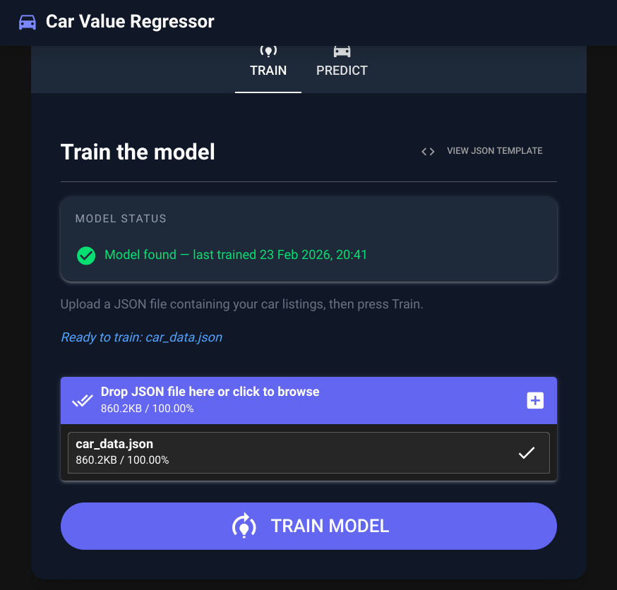

# Car Price Estimator

A desktop app that trains a machine learning model on Romanian car listings and predicts car prices.



## Install

```bash
git clone https://github.com/CorporalCiprian/CarValueRegressor.git
cd CarValueRegressor

python -m venv .venv
source .venv/bin/activate  # Windows: .venv\Scripts\activate

pip install -r requirements.txt
```

## Run

```bash
python main.py
```

## Usage

1. **Train tab** — upload a JSON file of car listings to train the model
2. **Predict tab** — enter car details to get a price estimate

Click **View JSON template** in the Train tab to see the expected format.
